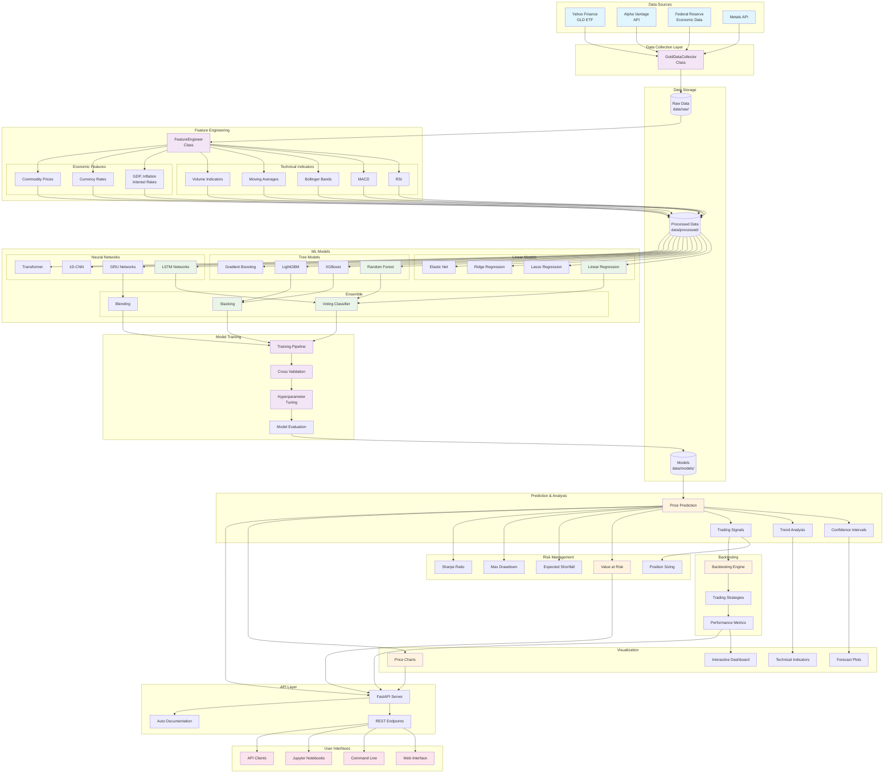
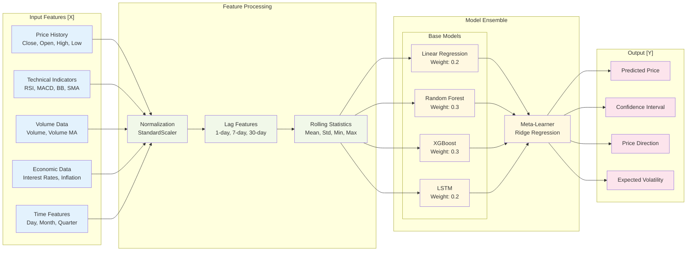
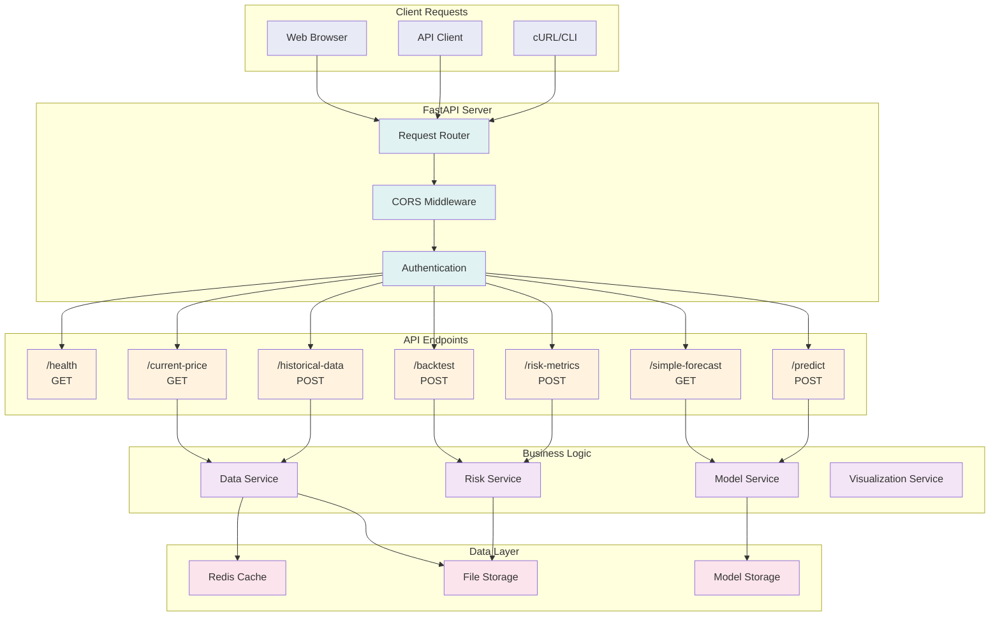
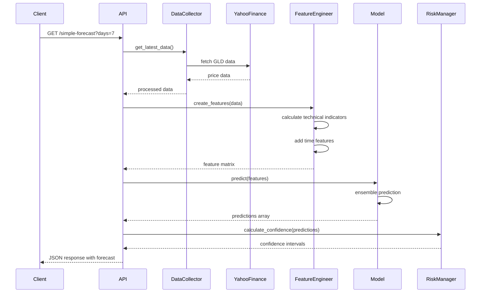

# Gold Price Forecasting System - Visual Architecture

## System Workflow Diagram

```mermaid
graph TB
    %% Data Sources
    subgraph "Data Sources"
        YF[Yahoo Finance<br/>GLD ETF]
        AV[Alpha Vantage<br/>API]
        FRED[Federal Reserve<br/>Economic Data]
        MA[Metals API]
    end

    %% Data Collection Layer
    subgraph "Data Collection Layer"
        DC[GoldDataCollector<br/>Class]
        YF --> DC
        AV --> DC
        FRED --> DC
        MA --> DC
    end

    %% Raw Data Storage
    subgraph "Data Storage"
        RD[(Raw Data<br/>data/raw/)]
        PD[(Processed Data<br/>data/processed/)]
        MD[(Models<br/>data/models/)]
    end

    DC --> RD

    %% Feature Engineering
    subgraph "Feature Engineering"
        FE[FeatureEngineer<br/>Class]
        subgraph "Technical Indicators"
            RSI[RSI]
            MACD[MACD]
            BB[Bollinger Bands]
            SMA[Moving Averages]
            VOL[Volume Indicators]
        end
        subgraph "Economic Features"
            ECON[GDP, Inflation<br/>Interest Rates]
            CURR[Currency Rates]
            COMM[Commodity Prices]
        end
    end

    RD --> FE
    FE --> RSI
    FE --> MACD
    FE --> BB
    FE --> SMA
    FE --> VOL
    FE --> ECON
    FE --> CURR
    FE --> COMM
    RSI --> PD
    MACD --> PD
    BB --> PD
    SMA --> PD
    VOL --> PD
    ECON --> PD
    CURR --> PD
    COMM --> PD

    %% Machine Learning Models
    subgraph "ML Models"
        subgraph "Linear Models"
            LR[Linear Regression]
            LASSO[Lasso Regression]
            RIDGE[Ridge Regression]
            ELASTIC[Elastic Net]
        end
        subgraph "Tree Models"
            RF[Random Forest]
            XGB[XGBoost]
            LGB[LightGBM]
            GB[Gradient Boosting]
        end
        subgraph "Neural Networks"
            LSTM[LSTM Networks]
            GRU[GRU Networks]
            CNN[1D-CNN]
            TRANSFORMER[Transformer]
        end
        subgraph "Ensemble"
            VOTING[Voting Classifier]
            STACKING[Stacking]
            BLENDING[Blending]
        end
    end

    PD --> LR
    PD --> LASSO
    PD --> RIDGE
    PD --> ELASTIC
    PD --> RF
    PD --> XGB
    PD --> LGB
    PD --> GB
    PD --> LSTM
    PD --> GRU
    PD --> CNN
    PD --> TRANSFORMER

    LR --> VOTING
    RF --> VOTING
    LSTM --> VOTING
    XGB --> STACKING
    LGB --> STACKING
    GRU --> BLENDING

    %% Model Training & Evaluation
    subgraph "Model Training"
        TRAIN[Training Pipeline]
        CV[Cross Validation]
        HP[Hyperparameter<br/>Tuning]
        EVAL[Model Evaluation]
    end

    VOTING --> TRAIN
    STACKING --> TRAIN
    BLENDING --> TRAIN
    TRAIN --> CV
    CV --> HP
    HP --> EVAL
    EVAL --> MD

    %% Prediction & Analysis
    subgraph "Prediction & Analysis"
        PRED[Price Prediction]
        CONF[Confidence Intervals]
        TREND[Trend Analysis]
        SIGNAL[Trading Signals]
    end

    MD --> PRED
    PRED --> CONF
    PRED --> TREND
    PRED --> SIGNAL

    %% Risk Management
    subgraph "Risk Management"
        VAR[Value at Risk]
        ES[Expected Shortfall]
        DRAWDOWN[Max Drawdown]
        SHARPE[Sharpe Ratio]
        POSITION[Position Sizing]
    end

    PRED --> VAR
    PRED --> ES
    PRED --> DRAWDOWN
    PRED --> SHARPE
    SIGNAL --> POSITION

    %% Backtesting
    subgraph "Backtesting"
        BT[Backtesting Engine]
        STRATEGY[Trading Strategies]
        PERFORMANCE[Performance Metrics]
    end

    SIGNAL --> BT
    BT --> STRATEGY
    STRATEGY --> PERFORMANCE

    %% Visualization
    subgraph "Visualization"
        CHARTS[Price Charts]
        INDICATORS[Technical Indicators]
        FORECAST[Forecast Plots]
        DASHBOARD[Interactive Dashboard]
    end

    PRED --> CHARTS
    TREND --> INDICATORS
    CONF --> FORECAST
    PERFORMANCE --> DASHBOARD

    %% API Layer
    subgraph "API Layer"
        FASTAPI[FastAPI Server]
        ENDPOINTS[REST Endpoints]
        DOCS[Auto Documentation]
    end

    PRED --> FASTAPI
    VAR --> FASTAPI
    PERFORMANCE --> FASTAPI
    CHARTS --> FASTAPI
    FASTAPI --> ENDPOINTS
    FASTAPI --> DOCS

    %% User Interfaces
    subgraph "User Interfaces"
        WEB[Web Interface]
        CLI[Command Line]
        JUPYTER[Jupyter Notebooks]
        API_CLIENT[API Clients]
    end

    ENDPOINTS --> WEB
    ENDPOINTS --> CLI
    ENDPOINTS --> JUPYTER
    ENDPOINTS --> API_CLIENT

    %% Styling
    classDef dataSource fill:#e1f5fe
    classDef processing fill:#f3e5f5
    classDef model fill:#e8f5e8
    classDef output fill:#fff3e0
    classDef interface fill:#fce4ec

    class YF,AV,FRED,MA dataSource
    class DC,FE,TRAIN,CV,HP processing
    class LR,RF,LSTM,VOTING,STACKING model
    class PRED,VAR,BT,CHARTS output
    class WEB,CLI,JUPYTER,API_CLIENT interface
```

## Model Architecture Details

```mermaid
graph LR
    subgraph "Input Features [X]"
        PRICE[Price History<br/>Close, Open, High, Low]
        TECH[Technical Indicators<br/>RSI, MACD, BB, SMA]
        VOL[Volume Data<br/>Volume, Volume MA]
        ECON[Economic Data<br/>Interest Rates, Inflation]
        TIME[Time Features<br/>Day, Month, Quarter]
    end

    subgraph "Feature Processing"
        NORM[Normalization<br/>StandardScaler]
        LAG[Lag Features<br/>1-day, 7-day, 30-day]
        ROLLING[Rolling Statistics<br/>Mean, Std, Min, Max]
    end

    subgraph "Model Ensemble"
        subgraph "Base Models"
            M1[Linear Regression<br/>Weight: 0.2]
            M2[Random Forest<br/>Weight: 0.3]
            M3[XGBoost<br/>Weight: 0.3]
            M4[LSTM<br/>Weight: 0.2]
        end
        
        META[Meta-Learner<br/>Ridge Regression]
    end

    subgraph "Output [Y]"
        PRED_PRICE[Predicted Price]
        CONF_INT[Confidence Interval]
        DIRECTION[Price Direction]
        VOLATILITY[Expected Volatility]
    end

    PRICE --> NORM
    TECH --> NORM
    VOL --> NORM
    ECON --> NORM
    TIME --> NORM

    NORM --> LAG
    LAG --> ROLLING

    ROLLING --> M1
    ROLLING --> M2
    ROLLING --> M3
    ROLLING --> M4

    M1 --> META
    M2 --> META
    M3 --> META
    M4 --> META

    META --> PRED_PRICE
    META --> CONF_INT
    META --> DIRECTION
    META --> VOLATILITY

    classDef input fill:#e3f2fd
    classDef process fill:#f1f8e9
    classDef model fill:#fff8e1
    classDef output fill:#fce4ec

    class PRICE,TECH,VOL,ECON,TIME input
    class NORM,LAG,ROLLING process
    class M1,M2,M3,M4,META model
    class PRED_PRICE,CONF_INT,DIRECTION,VOLATILITY output
```

## API Endpoint Flow

```mermaid
graph TD
    subgraph "Client Requests"
        WEB_CLIENT[Web Browser]
        API_CLIENT[API Client]
        CURL[cURL/CLI]
    end

    subgraph "FastAPI Server"
        ROUTER[Request Router]
        MIDDLEWARE[CORS Middleware]
        AUTH[Authentication]
    end

    subgraph "API Endpoints"
        HEALTH["/health<br/>GET"]
        CURRENT["/current-price<br/>GET"]
        FORECAST["/simple-forecast<br/>GET"]
        PREDICT["/predict<br/>POST"]
        HISTORICAL["/historical-data<br/>POST"]
        BACKTEST["/backtest<br/>POST"]
        RISK["/risk-metrics<br/>POST"]
    end

    subgraph "Business Logic"
        DATA_SERVICE[Data Service]
        MODEL_SERVICE[Model Service]
        RISK_SERVICE[Risk Service]
        VIZ_SERVICE[Visualization Service]
    end

    subgraph "Data Layer"
        CACHE[Redis Cache]
        FILES[File Storage]
        MODELS[Model Storage]
    end

    WEB_CLIENT --> ROUTER
    API_CLIENT --> ROUTER
    CURL --> ROUTER

    ROUTER --> MIDDLEWARE
    MIDDLEWARE --> AUTH

    AUTH --> HEALTH
    AUTH --> CURRENT
    AUTH --> FORECAST
    AUTH --> PREDICT
    AUTH --> HISTORICAL
    AUTH --> BACKTEST
    AUTH --> RISK

    CURRENT --> DATA_SERVICE
    FORECAST --> MODEL_SERVICE
    PREDICT --> MODEL_SERVICE
    HISTORICAL --> DATA_SERVICE
    BACKTEST --> RISK_SERVICE
    RISK --> RISK_SERVICE

    DATA_SERVICE --> CACHE
    DATA_SERVICE --> FILES
    MODEL_SERVICE --> MODELS
    RISK_SERVICE --> FILES

    classDef client fill:#e8eaf6
    classDef server fill:#e0f2f1
    classDef endpoint fill:#fff3e0
    classDef service fill:#f3e5f5
    classDef storage fill:#fce4ec

    class WEB_CLIENT,API_CLIENT,CURL client
    class ROUTER,MIDDLEWARE,AUTH server
    class HEALTH,CURRENT,FORECAST,PREDICT,HISTORICAL,BACKTEST,RISK endpoint
    class DATA_SERVICE,MODEL_SERVICE,RISK_SERVICE,VIZ_SERVICE service
    class CACHE,FILES,MODELS storage
```

## Real-time Data Flow

```mermaid
sequenceDiagram
    participant Client
    participant API
    participant DataCollector
    participant YahooFinance
    participant FeatureEngineer
    participant Model
    participant RiskManager

    Client->>API: GET /simple-forecast?days=7
    API->>DataCollector: get_latest_data()
    DataCollector->>YahooFinance: fetch GLD data
    YahooFinance-->>DataCollector: price data
    DataCollector-->>API: processed data
    
    API->>FeatureEngineer: create_features(data)
    FeatureEngineer->>FeatureEngineer: calculate technical indicators
    FeatureEngineer->>FeatureEngineer: add time features
    FeatureEngineer-->>API: feature matrix
    
    API->>Model: predict(features)
    Model->>Model: ensemble prediction
    Model-->>API: predictions array
    
    API->>RiskManager: calculate_confidence(predictions)
    RiskManager-->>API: confidence intervals
    
    API-->>Client: JSON response with forecast
```